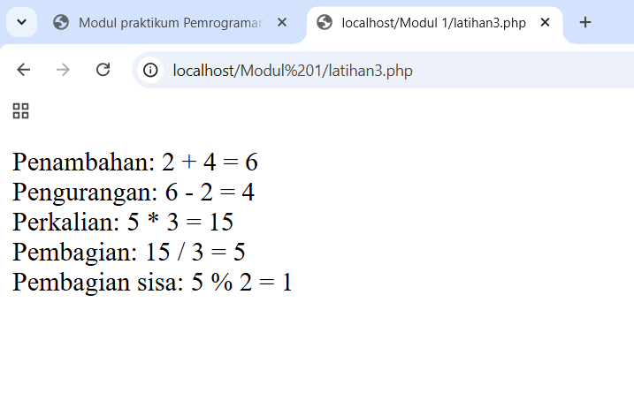

## Lab 1
| Modul  |  Lab 1
|-------|---------
| **NIM**   | 312310576
| **Nama** | Taufik Hidayat
| **Kelas** | TI.23.A6

### Latihan 1

- Hapus notasi ( $ ), lalu jalankan kode di atas. Apa yang terjadi? Lalu simpulkan.

**Penjelasan:**

- Simbol $ adalah wajib digunakan untuk mendeklarasikan variabel dalam PHP. Tanpa $, kode tidak akan dikenali sebagai deklarasi variabel, menyebabkan error pada saat runtime. Pastikan selalu menggunakan sintaks yang sesuai saat menulis kode PHP.

### Latihan 2 

 
- Amati apa hasil dari kode di atas ! Lalu simpulkan.

Menyimpulkan penampilan teks dan hasil operasi aritmatika menggunakan variabel dalam PHP. Variabel $angka diisi dengan nilai 99, kemudian dilakukan penjumlahan dengan angka 1 dan hasilnya disimpan di $angka_2. Output menunjukkan nilai awal variabel dan hasil operasi tersebut. PHP mendukung manipulasi variabel secara dinamis, termasuk operasi matematika sederhana seperti penjumlahan.

### Latihan 3

 
- Ketika kode di atas dijalankan, hasilnya di browser akan seperti ini:

**Penjeleasan:**
 
- Menunjukkan bagaimana operasi aritmatika dasar (penjumlahan, pengurangan, perkalian, pembagian, dan modulus) dilakukan dalam PHP. Hasil dari setiap operasi disimpan dalam variabel, lalu ditampilkan menggunakan perintah echo. PHP mendukung semua operator aritmatika dengan sintaks yang sederhana dan mudah dipahami.

### Latihan 4

 
Gantikan operator “+=” dengan : 

1. “-=” 

2. “*=” 

3. “/=” 

4. “%=”

5. “.=” 

Amati apa hasil dari operator tersebut ! lalu simpulkan.

-= (Pengurangan):

•	Kode: $x -= 3;

•	Hasil: Hasil dari operasi tersebut adalah = 1

•	Penjelasan: Nilai $x dikurangi dengan 3 (4 - 3 = 1).

*= (Perkalian):

•	Kode: $x *= 3;

•	Hasil: Hasil dari operasi tersebut adalah = 12

•	Penjelasan: Nilai $x dikalikan dengan 3 (4 * 3 = 12).

/= (Pembagian):

•	Kode: $x /= 3;

•	Hasil: Hasil dari operasi tersebut adalah = 1.3333333333333

•	Penjelasan: Nilai $x dibagi dengan 3 (4 / 3 ≈ 1.33).

%= (Modulus):

•	Kode: $x %= 3;

•	Hasil: Hasil dari operasi tersebut adalah = 1

•	Penjelasan: Sisa pembagian nilai $x oleh 3 adalah 1 (4 % 3 = 1).

.= (Konkatenasi):

•	Kode: $x .= 3;

•	Hasil: Hasil dari operasi tersebut adalah = 43

•	Penjelasan: Nilai $x dikonkatenasi (digabungkan) dengan 3 menjadi string "43".

### Latihan 5
 

 
- Isikan variable $my_name dengan nilai yang lain dan simpulkan!

**Keismpulan:**

- Jika nilai variabel $my_name diubah, maka hasil output bergantung pada apakah nilai tersebut sama dengan "someguy". Jika sama, program akan mencetak pesan "Your name is someguy!" diikuti dengan "Welcome to my homepage!". Namun, jika nilainya berbeda, hanya pesan "Welcome to my homepage!" yang ditampilkan. Kondisi ini menunjukkan bahwa blok kode di dalam if hanya dijalankan ketika ekspresi kondisi terpenuhi.

### Latihan 6

 
- Gantikan nilai dari variable $destination dengan “Amsterdam”, apa yang terjadi? Jelaskan alur kerja dari model switch!
 
- Ketika $destination diubah menjadi "Amsterdam", program mencocokkan nilai ini dengan setiap case dalam switch. Ketika cocok, yaitu pada case "Amsterdam", program menjalankan blok kode yang sesuai, mencetak "Bring an open mind", lalu keluar dari switch. Struktur switch sangat berguna untuk menggantikan rangkaian if-elseif yang panjang, terutama ketika nilai yang dibandingkan bersifat tetap.

### Latihan 7

 
- Ganti inkremen dengan $counter += 5, apa yang terjadi? Ganti looping for dengan menggunakan while, dan do-while? Jelaskan bagaimana alur kerja dari looping for, while, dan do-while?
 
**Penjelasan:**

•	for cocok untuk iterasi dengan jumlah yang pasti.

•	while digunakan untuk iterasi yang bergantung pada kondisi logis.

•	do-while memastikan blok kode dijalankan minimal sekali sebelum memeriksa kondisi.

### Latihan 8

- Buatlah sebuah array untuk menyimpan data kendaraan, 

**dengan isi data adalah sebagai berikut :**

 - Mobil - Sepeda - Bus - Becak - Truk - Andong - Sepeda Motor Tampilkan dengan menggunakan loop (perulangan),

 **setelah itu terapkan fungsi-fungsi dibawahini:**

- sort()

- rsort()

- asort()

- arsort()

- ksort()

- krsort()

terhadap array yang sudah dibuat, lalu tampilkan kembali dengan loop (perulangan), sehingga kita dapat membedakan tiap-tiap fungsi tersebut. 
Simpan hasil kerja dalam file Lat1_10.php, lalu simpulkan apa perbedaan dari keenam fungsi sorting tersebut diatas!
 
**Hasil:**

 
**Penjelasan:**

•	sort() dan rsort() berfokus pada pengurutan nilai array saja, dengan perbedaan urutan ascending dan descending.

•	asort() dan arsort() berfokus pada pengurutan nilai array, tetapi mempertahankan hubungan antara key dan value, dengan perbedaan urutan ascending dan descending.

•	ksort() dan krsort() berfokus pada pengurutan key array, dengan perbedaan urutan ascending dan descending.

### Latihan 9

 
- Amati apa hasil dari kode di atas ! Lalu simpulkan.

**Hasil:**

 
 •	Fungsi mySum tidak memodifikasi variabel $myNumber langsung, melainkan mengembalikan hasil penjumlahan yang kemudian disalin ke dalam variabel $myNumber.

•	Nilai $myNumber berubah setelah fungsi dijalankan karena hasil dari fungsi tersebut disalin kembali ke dalam variabel tersebut. Sebelumnya, nilai $myNumber adalah 0 dan setelah dijalankan fungsi, nilainya menjadi 7.

### Latihan 10

Buatlah sebuah fungsi untuk menyelesaikan permasalahan berikut : 

1. Perhitungan fibonacci dengan sistem rekursif, dimana inputan pada fungsi digunakan untuk menunjukkan bilangan ke sekian dari deret tersebut, 

2. Perhitungan nilai pangkat, dengan inputan x (bilangan yang akan dikuadratkan) dan inputan y(bilangan pangkat),
 
 
Hasil:

 
**Penjelasan:**
•	Fungsi power($x, $y) menghitung nilai x yang dipangkatkan dengan y menggunakan rekursi.
•	Fungsi ini akan mengembalikan 1 jika y adalah 0, karena apapun yang dipangkatkan dengan 0 hasilnya adalah 1.
•	Selain itu, fungsi ini akan mengalikan x dengan hasil dari pemanggilan fungsi power($x, $y - 1) untuk menghitung pangkat yang lebih besar.

